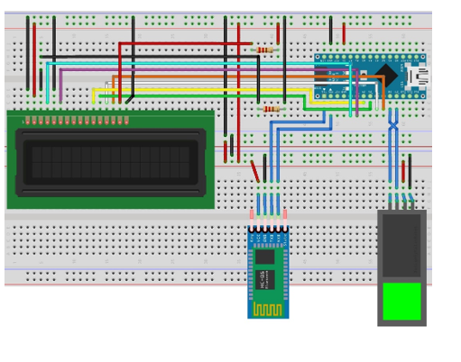
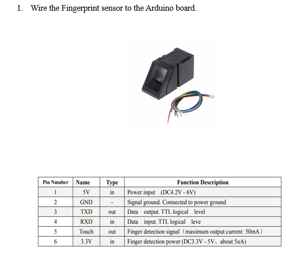
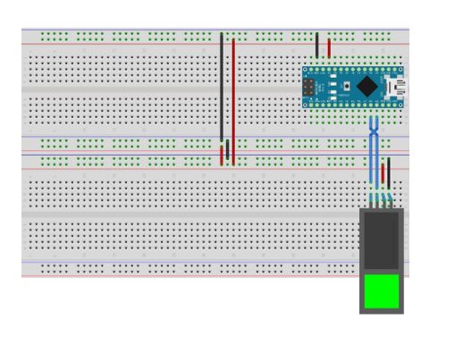
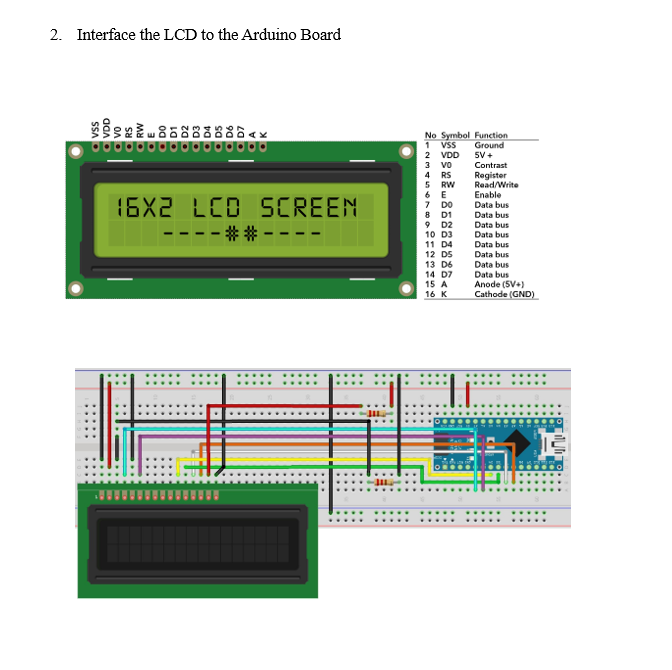
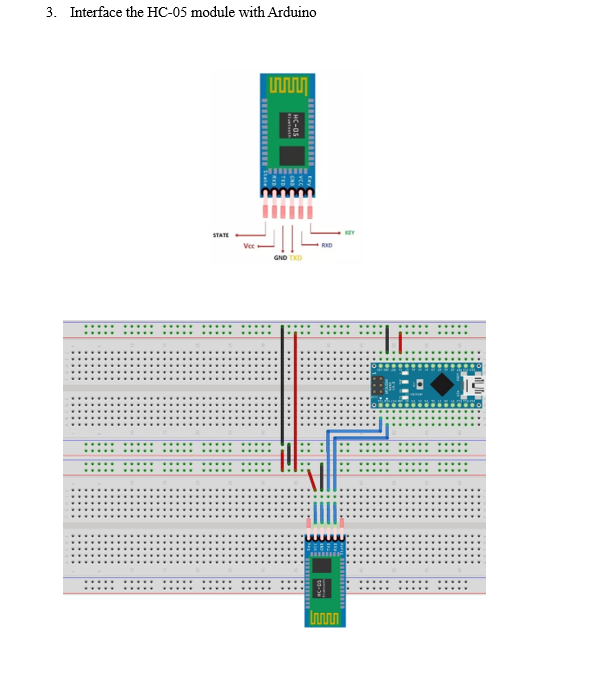

# Biometric Attendance System

## Objective

To store and manage fingerprints and verify them for attendance purposes.

## Equipment

- Arduino Nano board
- Fingerprint sensor
- LCD
- HC-05 Bluetooth module
- Jumper wires

## Procedure

1. Wire the Fingerprint sensor to the Arduino board.
2. Interface the LCD with the Arduino board.
3. Interface the HC-05 module with the Arduino.

## [Code](./Code.ino)

## Description of Modes

### Enroll Mode

- Used to enroll new fingerprints into the sensor.
- Prompts the user to enter an ID for the new fingerprint in the database.
- The user needs to scan the finger twice for it to be registered successfully.

### Attendance Mode

- Default mode of the system used to verify fingerprints and record attendance.
- Displays the ID and confidence percentage upon successful recognition.

### Delete Mode

- Used by administrators to delete specific prints from the sensor database.
- Requires a passcode (default: 1234) to delete an ID.

### Empty Database

- Used to delete all fingerprints stored in the sensor.
- Requires passcode authentication to execute.

## Circuit Diagram

- Steps:
  
  
  
  
